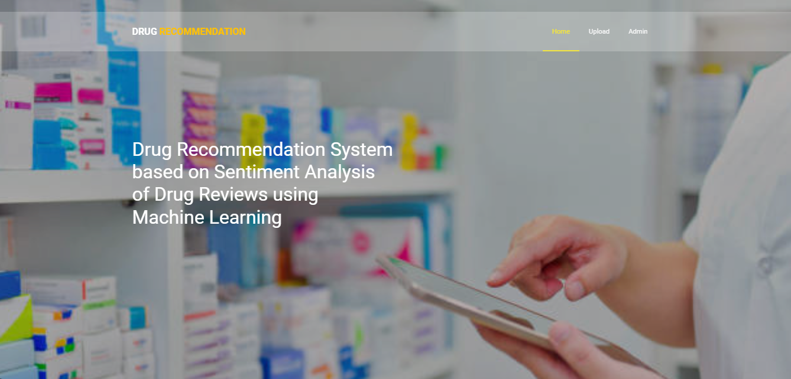
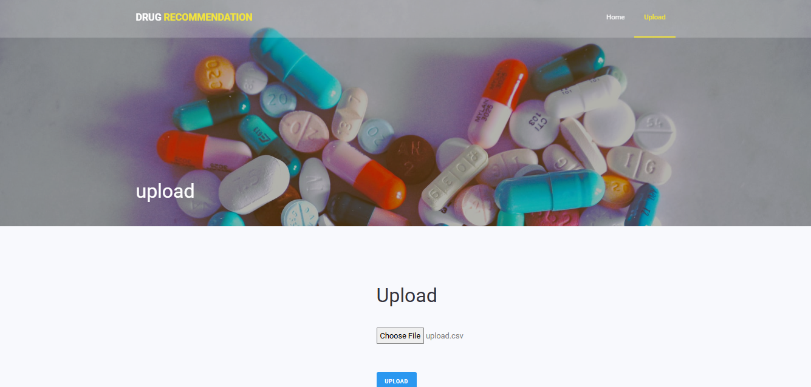
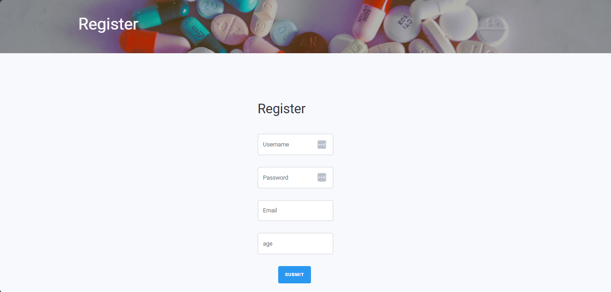
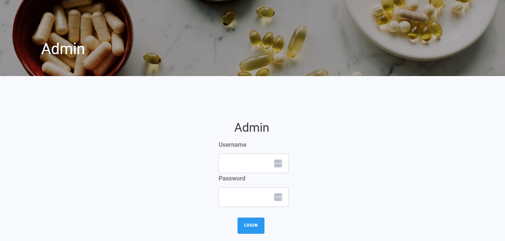
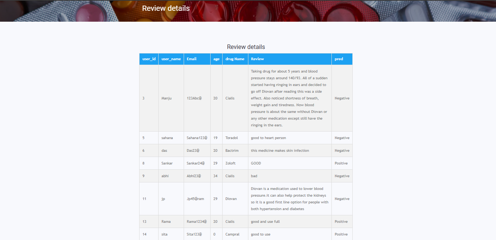

## Drug Recommendation System based on Sentiment Analysis of Drug Reviews using Machine Learning 💊



The Drug Recommendation System is a machine learning-based application designed to recommend drugs based on sentiment analysis of user reviews. Given the increasing reliance on self-medication due to the unavailability of proper medical consultation, this system aims to provide accurate drug recommendations by analyzing patient reviews. The project leverages various machine learning techniques to predict sentiment and recommend the best-suited drugs for specific health conditions.


<br>
<br>


##  🚀 Introduction

Since the emergence of COVID-19, the availability of proper medical resources has been critical. Many individuals began self-medicating without proper consultation, leading to adverse health outcomes. This project presents a drug recommendation system that leverages sentiment analysis on drug reviews to suggest medications, aiming to ease the burden on healthcare providers.


<br>


## ✨ Features

**• Sentiment Analysis:** Utilizes sentiment analysis to understand patient reviews about drugs.

**• Machine Learning Models:** Implements multiple machine learning models including Linear SVC, TF-IDF, Word2Vec, and more.

**• Accuracy:** Achieves a high accuracy rate, with Linear SVC using TF-IDF vectorization outperforming other models with 93% accuracy.

**• Evaluation Metrics:** Performance evaluated using precision, recall, F1-score, accuracy, and AUC score.


<br>


## 🔧 Project Structure

**• System Design:** Includes system architecture, input, and output design.

**• System Architecture:**

    1. Data Collection: Gather drug reviews from reliable sources.

    2. Data Preprocessing: Clean and prepare the data for analysis.

**• System Analysis:** Compares the existing system with the proposed system, offering an in-depth study.

**• Software Environment:** The project is developed using Python with Flask as the web framework.

**• Implementation:** The project is modular, with source code provided for each module.

**• Testing:** The system undergoes rigorous testing to ensure functionality.


<br>


## 💻 System Requirements

**Programming Language:** Python

**Framework:** Flask

**Libraries:**
                Pandas,
                Scikit-learn,
                NLTK,
                NumPy,
                Matplotlib.


<br>


## ⚙️ Installation

Clone the project

```bash
  git clone https://github.com/ChethanV20/Drug-recommendation-system-Report.git
```

Go to the project directory

```bash
  cd Drug-Recommendation-System
```

Install dependencies

```bash
 pip install -r requirements.txt

```


<br>


## 🔗 Deployment

To deploy this project run

1.Run the Flask web application:

```bash
  python app.py

```
2. Open your web browser and go to http://localhost:5000 to access the drug recommendation system.


<br>


## 🎥 Screenshots

<div align="center">
 
| Home Page | 
| :---         |
|   | 

| Upload Page|
|     :---      |
|     | 

| Registration Page |
|          :--- |
|     |

| Admin Page | 
| :---         | 
|   |

| Review Page | 
| :---         | 
|   |

</div>

##


<br>


## 💻 Testing

The system has been tested using various datasets and achieved an accuracy of 93% with the Linear SVC model using TF-IDF vectorization.


<br>


## 📄 Conclusion

The Drug Recommendation System effectively reduces the burden on healthcare providers by providing accurate drug recommendations based on sentiment analysis of user reviews. The system shows promising results and could be further improved by incorporating more advanced machine learning techniques and larger datasets.


<br>


## Authors

- [@ChethanV20](https://github.com/ChethanV20)


<br>


## 📍 License

This project is licensed under the MIT License - see the LICENSE file for details.
 
